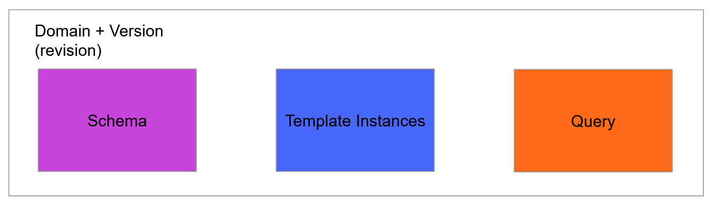

# Domain
A domain is a collection of data models. Normally there are different domains for different use cases. More specifically a domain consists of templates and types. A template is a data model that is later implemented by one or more template instances.



## Versioned
Every domain is versioned, and the version change whenever the schema of a domain is updated with a breaking change. Each version can be queried individually so that consumers are not directly affected by breaking changes. Also each version has its own set of template instances.

## Updating the Schema
There are three different conflict modes that can be used when updating a schema.

Conflict modes:
* **Patch**: This is the default mode, and it updates the schema without updating the version as long as there are no unsafe / breaking changes, or else it will fail.
* **Update**: Updates the schema by updating the version of the domain. Remember instances are kept per version, so a migration is needed afterwards.
* **Force**: Updates the schema without updating the version, and does not check for unsafe changes. This mode might cause issues for clients depending on the schema so be careful when using this mode.

## Schema
The schema is in format of [GraphQL Schema Definition Language](https://graphql.org/learn/schema). However, we also have some custom directives, and the most important one is the `@template` directive. This directive specifies if a type is considered a template, which indicates that it will be filled by template instances.

Here is an example of a schema modeling Covid-19
```graphql
type Demographics @template {
    "The amount of people"
    populationSize: Int,
    "The population growth rate"
    growthRate: Float,
}

type Country @template
{
    name: String,
    demographics: Demographics,
    deaths: TimeSeries,
    confirmed: TimeSeries,
}
```
The template directive also generates a list endpoint for top level retrieval of template instances.
For example given the schema above you'll get:
```graphql
type Query {
    demographicsList(externalIds: [ID]): [Demographics]
    countryList(externalIds: [ID]): [Country]
}
```

## Template Instances
Template instances are implementing a specific template type by specifying what happens when a template field is queried. We call this concept of resolving a field for a field resolver. So each field of an instance is bound to a field resolver. And there are multiple types of field resolvers. Each template instance also has an externalId that identifies the instance.

So given the schema above a set of template instances might look like this in Python
```python
[
    TemplateInstance(
        external_id="norway",
        template_name="Country",
        field_resolvers={
            "name": ConstantResolver(value="Norway"),
            "demographics": ConstantResolver(value="norway_demographics")
            "deaths": TimeSeriesResolver("Norway_deaths"),
            "confirmed": TimeSeriesResolver("Norway_confirmed"),
        },
    ),
    TemplateInstance(
        external_id="norway_demographics",
        template_name="Demographics",
        field_resolvers={
            "populationSize": ConstantResolver(value=5328000),
            "growthRate": ConstantResolver(value=0.02)
        },
    ),
]
```

See [Template Instance](./template_instance.md) for a list of field resolvers.

## Query
The domain can be queried by using [GraphQL](https://graphql.org/learn/).

Example of a query given the example schema:
```graphql
{
    countryList {
       name,
       demographics {
           populationSize,
           growthRate
       },
       deaths {
           datapoints(limit: 100) {
               timestamp,
               value
           }
       }
    }
}
```

## Experimental Features
* [Search Capabilities](./search.md)
