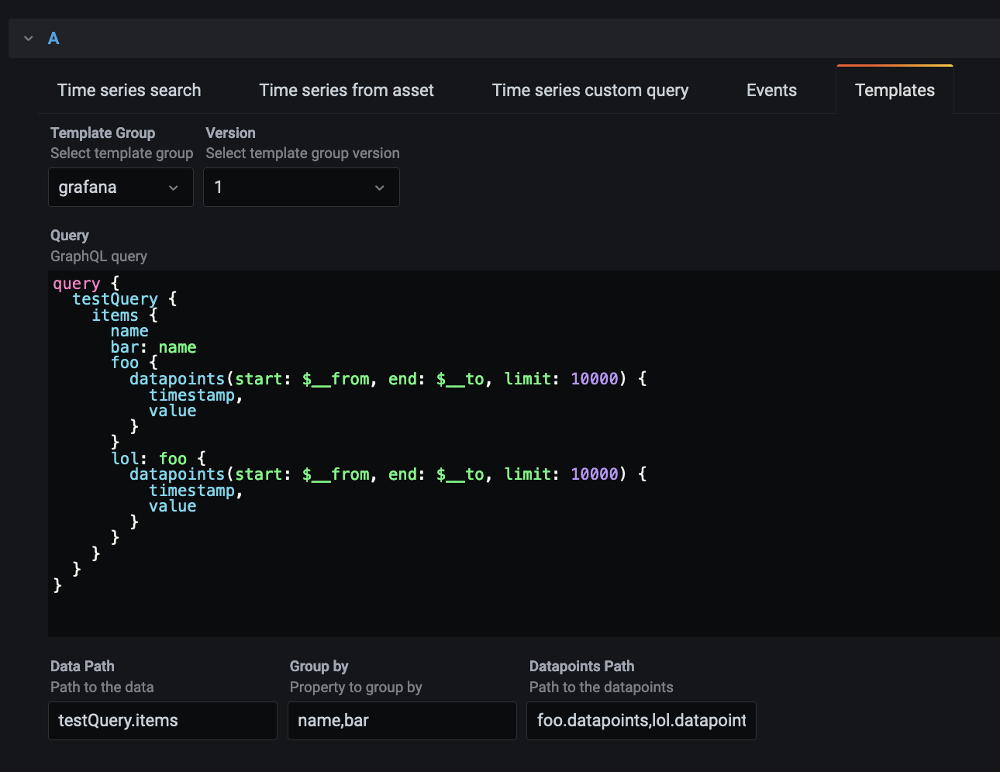

# Getting Started with Template Groups
To learn more about the concept of Template Groups see [this](../concepts/domains.md).

## Prerequisites
1. You need to have a CDF account that has `group:list` scoped to at least yourself.
1. This account also needs to have a group named `domains-alpha`.

## Using the UI
The current UI can be found at https://dev.fusion.cogniteapp.com/{project}/domains.

## Using the Python SDK
`pip install cognite-sdk-experimental`

## Using the JS SDK
`npm install @cognite/sdk-beta`

## Using the Grafana plugin
This is a modified version of the official Cognite Grafana datasource with added support for templates.
General information about tha plugin can be found in the 
[Cognite Grafana datasource documentation](https://docs.cognite.com/cdf/dashboards/guides/grafana/getting_started.html).

If you already have Grafana on your computer:
1. Download [this zip file](../assets/cognite-templates-grafana-datasource.zip)
2. Extract the file into your local Grafana plugins folder 
3. Restart Grafana

### Installation
Run Grafana with the plugin using docker:
1. `docker run -p 3000:3000 --name grafana -e "GF_INSTALL_PLUGINS=https://github.com/cognitedata/templates-docs/raw/master/assets/cognite-templates-grafana-datasource.zip;cognitedata-templates-datasource" grafana/grafana`
5. You should now have access to Grafana at http://localhost:3000. Standard username/password for logging in is admin/admin.

### Getting started
Once installed, follow these steps to use the plugin:
1. In Grafana, go to "Configuration", click Data Sources, then Add data source, and choose `Cognite Data Fusion - Templates`
2. Give the data source a name, provide the name of the project and your API key. Make sure the API key is configured according to the prerequisites above.
3. Click "Save & test"
4. Create a dashboard with a panel, and choose the CDF Templates datasource you created in the previous step.
5. Go to the "Template Query" tab, select your domain in the dropdown and have fun!

